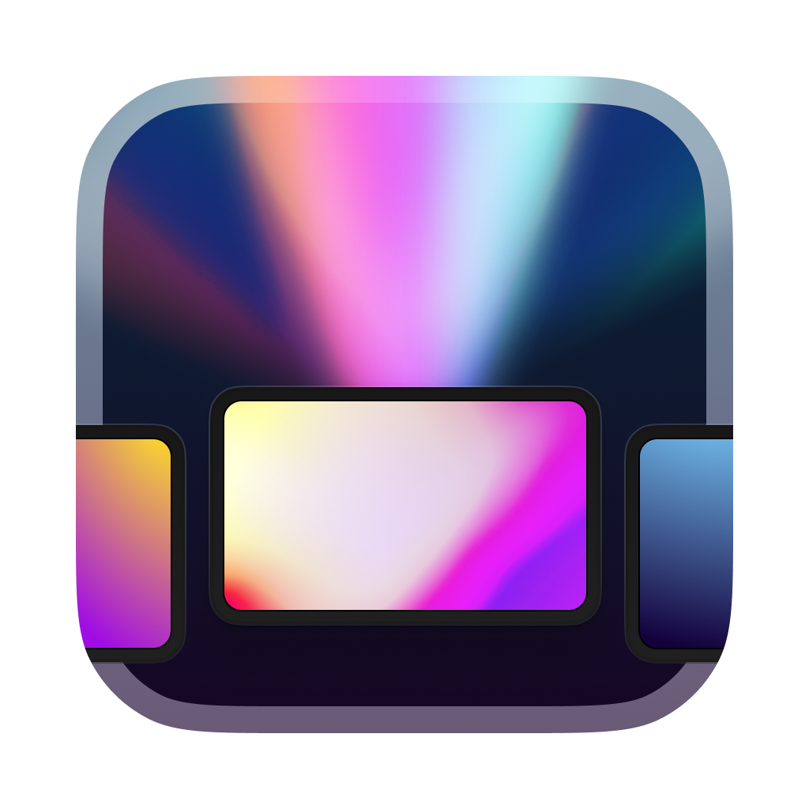

# Acrylic

##### for macOS

###### *If you're looking for the iOS version, go [here](https://github.com/EthanLipnik/Acrylic-iOS)*

Acrylic is a fluid wallpaper engine for Mac, allowing you to create and enjoy live, color-changing mesh gradient wallpapers right on your desktop. It also has an iOS counterpart with more limited functionality.

## Features

- **Fluid Wallpaper**: Enjoy live, color-changing mesh gradients right on your desktop.
- **Video Wallpaper**: Download and use videos from Pixabay on your desktop, or use your own videos. Acrylic can even compress the videos for better battery life.
- **Export Your Own Mesh Gradients**: Create your own unique mesh gradients and export them for use anywhere.

## Installation

Acrylic is available for download on the App Store. Alternatively, you can build the app yourself from the source code.

## Contributing

Anyone can contribute to the development of Acrylic. We welcome and appreciate any contributions, no matter how small.

## License

Acrylic is licensed under the MIT License. See the `LICENSE` file for more details.

## Support and FAQ

Support for Acrylic is provided through GitHub issues. If you encounter a problem or have a question, feel free to open a new issue there. We also have an FAQ section that might answer some of your questions.

## Additional Resources

For more information about Acrylic and other apps, visit [ethanlipnik.com/apps/acrylic](http://ethanlipnik.com/apps/acrylic).
